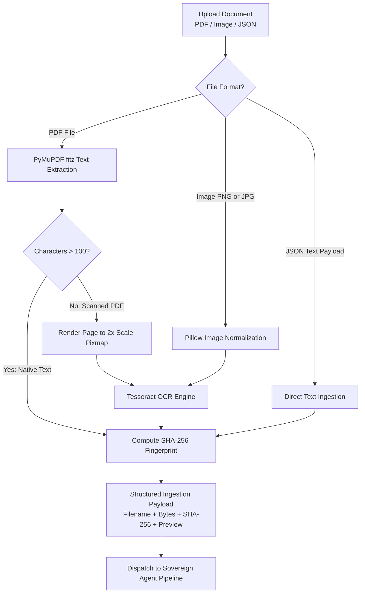
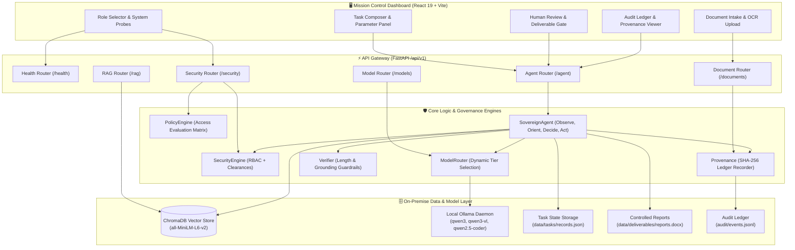
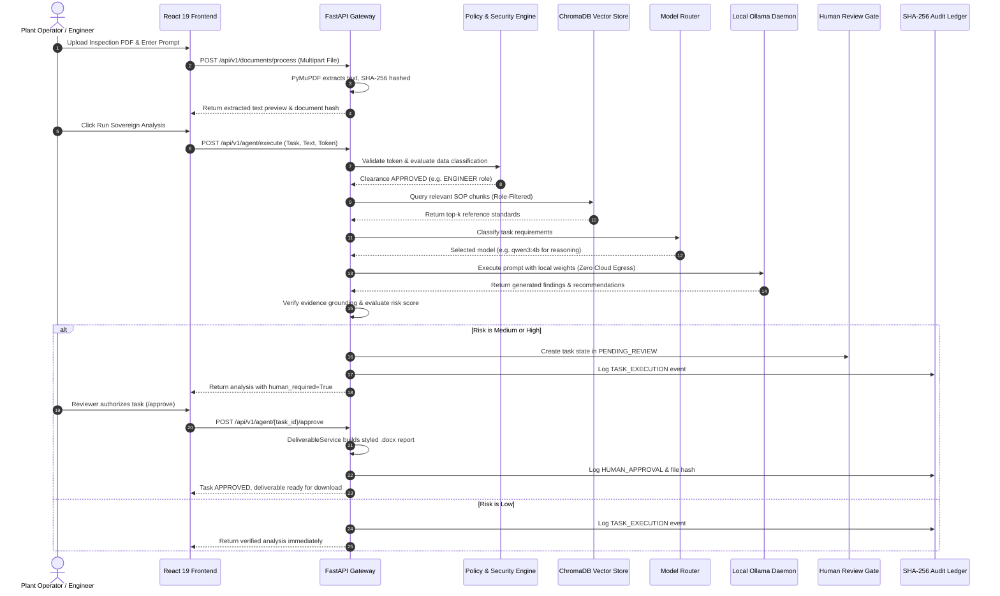
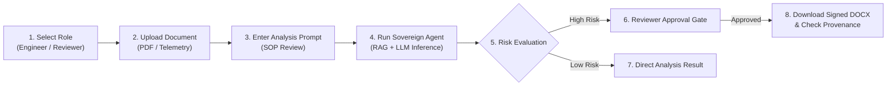
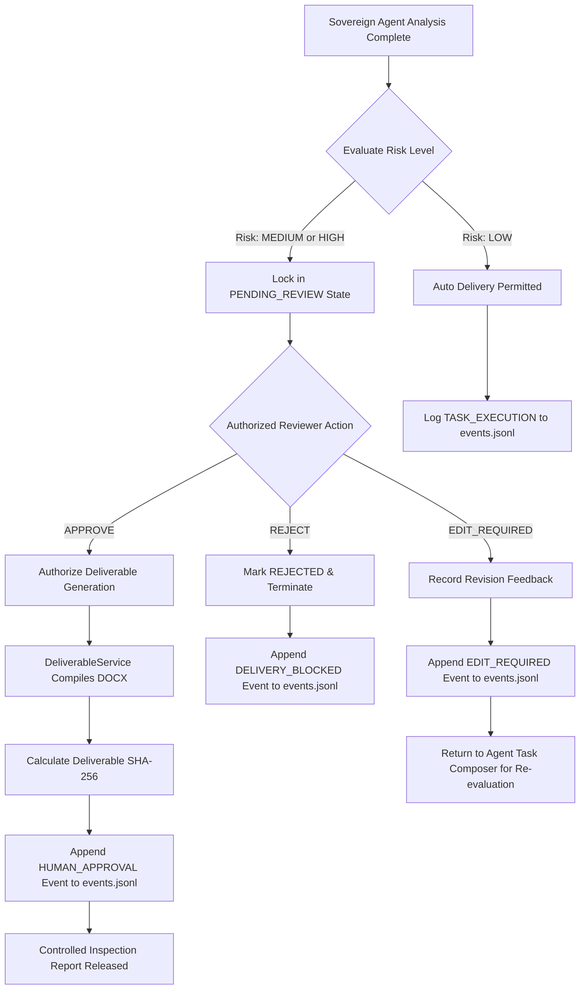
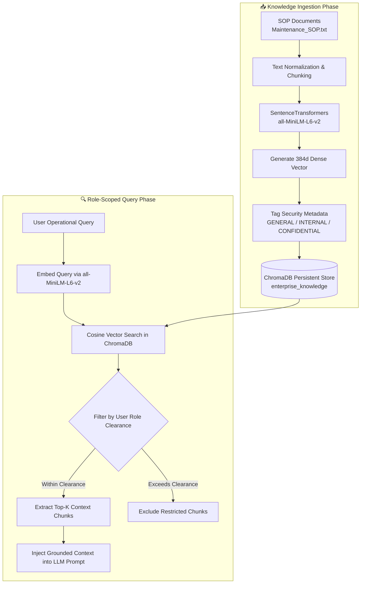
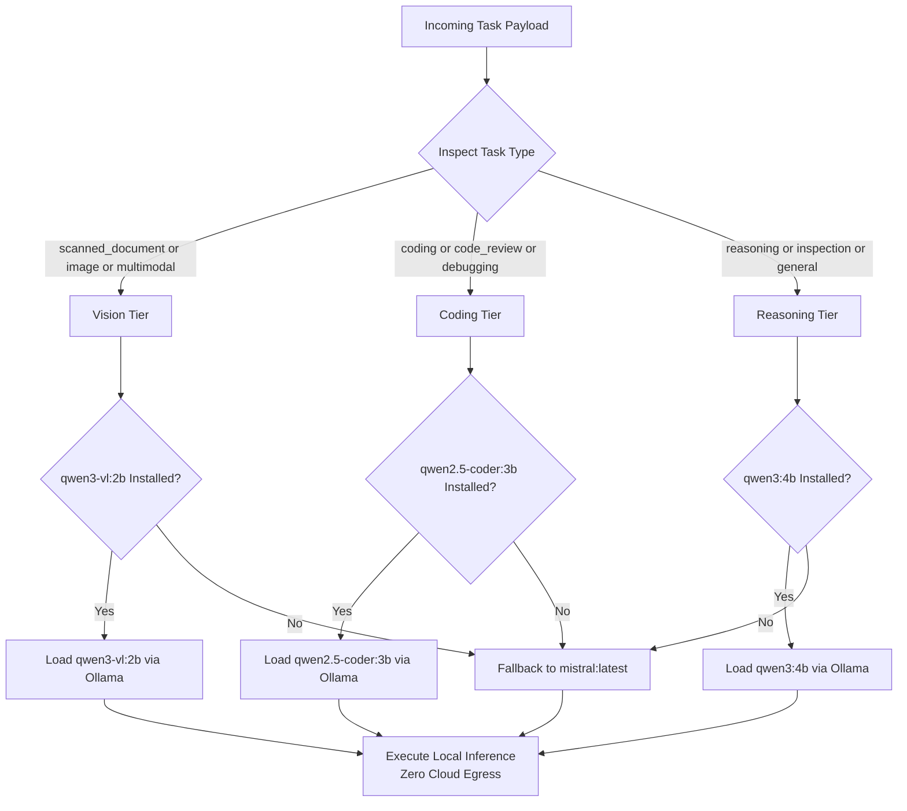
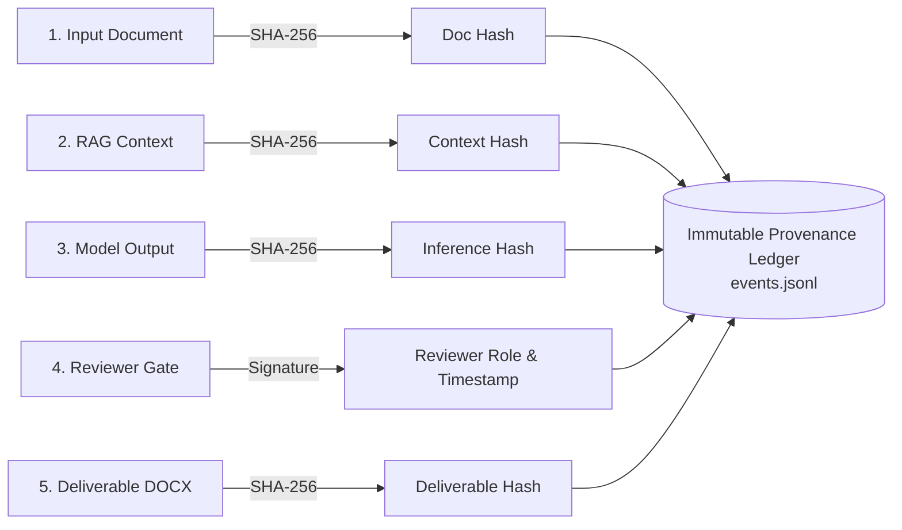
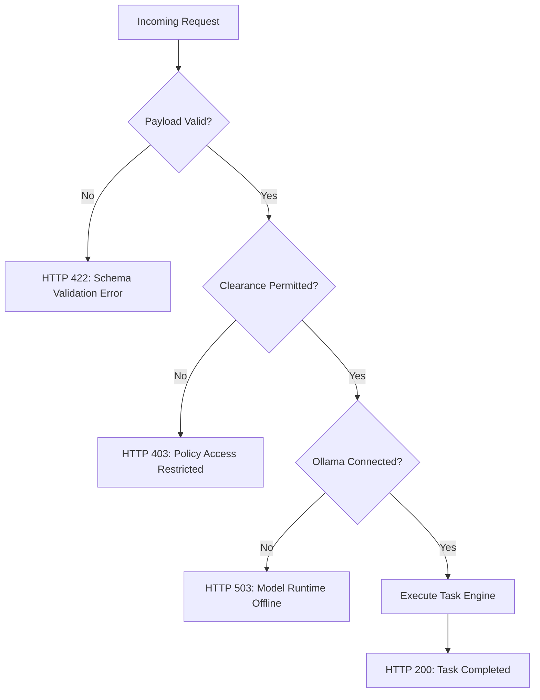

<div align="center">

<h1>🚀 Sovereign AI Workbench</h1>

<p align="center">
  <strong>Enterprise-grade, air-gapped on-premise AI orchestrator with zero network egress, role-based governance, and verified agentic workflows.</strong>
</p>

<p align="center">
  
  
  
  
  
  
  
</p>

<p align="center">
  
</p>

</div>

<hr>

<h2>📌 Project Overview</h2>

<p>
Modern organizations operating in defense, energy generation, heavy manufacturing, and critical infrastructure handle highly confidential engineering manuals, incident telemetry, and sensor logs. Transmitting this sensitive operational data to public cloud AI APIs introduces unacceptable regulatory violations, privacy exposure, and perimeter security risks.
</p>

<p>
Sovereign AI Workbench resolves this security dilemma by delivering a self-contained, air-gapped AI operations environment that executes exclusively within your internal hardware perimeter with guaranteed zero external network egress. The system pairs local open-source language models with role-scoped semantic search, multi-stage agent reasoning, tamper-evident audit ledgers, and human-in-the-loop review barriers.
</p>

<p>
The platform is designed for compliance officers, plant engineers, security auditors, and system administrators who require dependable artificial intelligence without ceding data sovereignty or network isolation. By enforcing cryptographically signed provenance and mandatory human gate reviews before delivering operational documents, Sovereign AI Workbench provides full governance across every stage of the reasoning lifecycle.
</p>

<hr>

<h2>✨ Key Features</h2>

<table>
  <thead>
    <tr>
      <th>Feature</th>
      <th>Architecture Layer</th>
      <th>Capability Summary</th>
    </tr>
  </thead>
  <tbody>
    <tr>
      <td>🛡️ <strong>Air-Gapped Sovereign Execution</strong></td>
      <td>Core Runtime</td>
      <td>Executes all LLM inference and vector operations strictly on-premise via Ollama and ChromaDB with zero outbound socket connections.</td>
    </tr>
    <tr>
      <td>👥 <strong>Role-Based Access Control (RBAC)</strong></td>
      <td>Security Gateway</td>
      <td>Enforces clearance roles (ADMIN, REVIEWER, ENGINEER, OPERATOR) against document classifications (GENERAL, INTERNAL, CONFIDENTIAL).</td>
    </tr>
    <tr>
      <td>🧠 <strong>Dynamic Model Routing</strong></td>
      <td>Model Router</td>
      <td>Inspects incoming tasks and dispatches jobs to specialized local models (qwen3:4b for reasoning, qwen3-vl:2b for vision, qwen2.5-coder:3b for code).</td>
    </tr>
    <tr>
      <td>🔍 <strong>Role-Filtered Sovereign RAG</strong></td>
      <td>Retrieval Engine</td>
      <td>Extracts text with OCR fallback, indices semantic chunks into ChromaDB with all-MiniLM-L6-v2, and scopes search strictly by user clearance.</td>
    </tr>
    <tr>
      <td>✍️ <strong>Human-in-the-Loop Governance</strong></td>
      <td>Agent Engine</td>
      <td>Holds high-risk operations pending explicit reviewer sign-off, producing tamper-evident DOCX reports backed by a SHA-256 provenance ledger.</td>
    </tr>
    <tr>
      <td>📊 <strong>Interactive Mission Control</strong></td>
      <td>Frontend Dashboard</td>
      <td>React 19 single-page application with real-time daemon probes, document preview, interactive workflow visualizer, and audit inspector.</td>
    </tr>
  </tbody>
</table>

<h3>📄 Document Intake & OCR Ingestion Pipeline</h3>

<p>
The following flowchart illustrates how multi-format files are ingested, converted to text, and cryptographically fingerprinted:
</p>



<hr>

<h2>🛠️ Technology Stack</h2>

<table>
  <thead>
    <tr>
      <th>Category</th>
      <th>Technology</th>
      <th>Version / Spec</th>
      <th>Role in Platform</th>
    </tr>
  </thead>
  <tbody>
    <tr>
      <td>Frontend UI</td>
      <td>React</td>
      <td>19.2.8</td>
      <td>Component architecture, mission control interface, and reactive state management</td>
    </tr>
    <tr>
      <td>Frontend Tooling</td>
      <td>Vite</td>
      <td>8.2.2</td>
      <td>Hot module replacement, rapid compilation, and production bundling</td>
    </tr>
    <tr>
      <td>Styling</td>
      <td>Tailwind CSS</td>
      <td>4.3.3</td>
      <td>Modern utility-first styling with responsive layouts</td>
    </tr>
    <tr>
      <td>Icons & UI</td>
      <td>Lucide React</td>
      <td>1.39.0</td>
      <td>Visual icon set for status badges, navigation, and telemetry panels</td>
    </tr>
    <tr>
      <td>HTTP Client</td>
      <td>Axios</td>
      <td>1.20.0</td>
      <td>Asynchronous REST client with automated bearer token injection for RBAC roles</td>
    </tr>
    <tr>
      <td>Backend Framework</td>
      <td>FastAPI</td>
      <td>0.115+</td>
      <td>High-performance asynchronous API gateway and route management</td>
    </tr>
    <tr>
      <td>ASGI Server</td>
      <td>Uvicorn</td>
      <td>Standard</td>
      <td>Production ASGI server for handling concurrent HTTP traffic</td>
    </tr>
    <tr>
      <td>Data Validation</td>
      <td>Pydantic</td>
      <td>v2</td>
      <td>Strict request and response schema enforcement with typed validation</td>
    </tr>
    <tr>
      <td>Local LLM Server</td>
      <td>Ollama</td>
      <td>CLI Daemon</td>
      <td>Hardware-accelerated local model execution with zero cloud egress</td>
    </tr>
    <tr>
      <td>Reasoning Models</td>
      <td>Qwen3 / Mistral</td>
      <td>4B / 7B</td>
      <td>Deterministic root-cause analysis, SOP verification, and synthesis</td>
    </tr>
    <tr>
      <td>Vision Models</td>
      <td>Qwen3-VL</td>
      <td>2B</td>
      <td>Multimodal diagram understanding, image OCR validation, and visual inspection</td>
    </tr>
    <tr>
      <td>Coding Models</td>
      <td>Qwen2.5-Coder</td>
      <td>3B</td>
      <td>Syntax verification, configuration review, and technical parsing</td>
    </tr>
    <tr>
      <td>Vector Database</td>
      <td>ChromaDB</td>
      <td>Persistent</td>
      <td>On-premise embedding storage, metadata filtering, and semantic index search</td>
    </tr>
    <tr>
      <td>Embeddings</td>
      <td>SentenceTransformers</td>
      <td>all-MiniLM-L6-v2</td>
      <td>Local 384-dimensional dense vector embeddings running via PyTorch</td>
    </tr>
    <tr>
      <td>PDF Parsing</td>
      <td>PyMuPDF / fitz</td>
      <td>Latest</td>
      <td>High-throughput native PDF text parsing and page pixmap rendering</td>
    </tr>
    <tr>
      <td>OCR Fallback</td>
      <td>Tesseract / Pillow</td>
      <td>Tesseract 5</td>
      <td>Optical character recognition for scanned image pages lacking native text</td>
    </tr>
    <tr>
      <td>Deliverables</td>
      <td>python-docx</td>
      <td>Latest</td>
      <td>Automated compilation of styled, auditable Microsoft Word deliverables</td>
    </tr>
    <tr>
      <td>Provenance</td>
      <td>JSONL & Hashlib</td>
      <td>SHA-256</td>
      <td>Cryptographic fingerprinting and append-only audit event logging</td>
    </tr>
  </tbody>
</table>

<hr>

<h2>🏗️ System Architecture</h2>

<p>
The following diagram illustrates the relationship between the client layer, the API gateway, the core security and policy engines, and the isolated storage runtimes:
</p>



<hr>

<h2>🔄 Data Flow & Request Lifecycle</h2>

<p>
When an operator submits a maintenance report for sovereign automated evaluation, the data travels through seven deterministic stages:
</p>



<hr>

<h2>🔌 API Mapping & Endpoint Directory</h2>

<p>
All API routes are served under the <code>/api/v1</code> prefix. The table below outlines all available endpoints, their payload requirements, and corresponding frontend callers:
</p>

<table>
  <thead>
    <tr>
      <th>Method</th>
      <th>Endpoint</th>
      <th>Purpose</th>
      <th>Request Payload</th>
      <th>Response Structure</th>
      <th>Used By Frontend</th>
    </tr>
  </thead>
  <tbody>
    <tr>
      <td>GET</td>
      <td>/api/v1/health</td>
      <td>Probe service and daemon health</td>
      <td>None</td>
      <td>status, app_name, version, environment, ollama_connected</td>
      <td>StatusHeaderBar</td>
    </tr>
    <tr>
      <td>GET</td>
      <td>/api/v1/security/me</td>
      <td>Retrieve authenticated user profile</td>
      <td>Authorization: Bearer token</td>
      <td>username, role, clearance, token</td>
      <td>RoleClearanceSelector</td>
    </tr>
    <tr>
      <td>POST</td>
      <td>/api/v1/security/evaluate</td>
      <td>Evaluate clearance against classification</td>
      <td>classification (query or body)</td>
      <td>allowed, role, classification, action, reason</td>
      <td>SecurityPolicyTab</td>
    </tr>
    <tr>
      <td>POST</td>
      <td>/api/v1/documents/process</td>
      <td>Parse PDF or JSON and calculate hash</td>
      <td>Multipart file upload or JSON</td>
      <td>filename, bytes, sha256, text, text_preview, status</td>
      <td>DocumentIntakeSection</td>
    </tr>
    <tr>
      <td>POST</td>
      <td>/api/v1/rag/ingest</td>
      <td>Index document into ChromaDB</td>
      <td>document_id, filename, text, classification, metadata</td>
      <td>document_id, chunks_indexed, status, message</td>
      <td>KnowledgeManagementTab</td>
    </tr>
    <tr>
      <td>POST</td>
      <td>/api/v1/rag/query</td>
      <td>Role-filtered semantic retrieval</td>
      <td>query, top_k, environment</td>
      <td>query, results (chunk_id, text, metadata, distance)</td>
      <td>SemanticSearchPanel</td>
    </tr>
    <tr>
      <td>GET</td>
      <td>/api/v1/rag/maintenance/stats</td>
      <td>Retrieve vector collection statistics</td>
      <td>Authorization: Bearer token</td>
      <td>total_documents, collections, environments</td>
      <td>RAGTelemetryWidget</td>
    </tr>
    <tr>
      <td>POST</td>
      <td>/api/v1/rag/maintenance/cleanup</td>
      <td>Purge test vector records safely</td>
      <td>confirm (boolean), purge_all_non_prod</td>
      <td>status, deleted_count, message</td>
      <td>AdminConsole</td>
    </tr>
    <tr>
      <td>GET</td>
      <td>/api/v1/models/status</td>
      <td>Check installed Ollama models</td>
      <td>None</td>
      <td>ollama_connected, models (name, role, installed, available)</td>
      <td>ModelInventoryCard</td>
    </tr>
    <tr>
      <td>POST</td>
      <td>/api/v1/models/route</td>
      <td>Select optimal model for a task</td>
      <td>task_type, prompt, classification</td>
      <td>selected_model, tier, temperature, external_api_allowed</td>
      <td>TaskRoutingInspector</td>
    </tr>
    <tr>
      <td>POST</td>
      <td>/api/v1/models/generate</td>
      <td>Direct inference with routed model</td>
      <td>task_type, prompt, classification, image</td>
      <td>status, routing, output</td>
      <td>DirectInferenceConsole</td>
    </tr>
    <tr>
      <td>POST</td>
      <td>/api/v1/agent/execute</td>
      <td>Run multi-stage agent workflow</td>
      <td>task, document_text, filename, image</td>
      <td>task_id, answer, security, model, verification, risk, human_gate</td>
      <td>AgentWorkspace</td>
    </tr>
    <tr>
      <td>GET</td>
      <td>/api/v1/agent/{task_id}</td>
      <td>Retrieve persisted task state</td>
      <td>Path parameter: task_id</td>
      <td>Full AgentTaskResponse structure</td>
      <td>TaskHistoryView</td>
    </tr>
    <tr>
      <td>POST</td>
      <td>/api/v1/agent/{task_id}/approve</td>
      <td>Authorize task & generate DOCX</td>
      <td>comment (optional string)</td>
      <td>status, task_id, human_gate, delivery, deliverable</td>
      <td>HumanGateModal</td>
    </tr>
    <tr>
      <td>POST</td>
      <td>/api/v1/agent/{task_id}/reject</td>
      <td>Reject task & block deliverable</td>
      <td>comment (optional string)</td>
      <td>status, task_id, human_gate, delivery, deliverable</td>
      <td>HumanGateModal</td>
    </tr>
    <tr>
      <td>POST</td>
      <td>/api/v1/agent/{task_id}/edit</td>
      <td>Request edits on agent analysis</td>
      <td>edit_instructions, feedback</td>
      <td>status, task_id, human_gate, delivery, deliverable</td>
      <td>HumanGateModal</td>
    </tr>
  </tbody>
</table>

<hr>

<h2>📁 Project Directory Structure</h2>

<pre><code>On-Premise-AI-workbench/
├── .gitignore                          # Standard git ignore definitions
├── Pump_Inspection_Report.pdf          # Baseline industrial test document
├── README.md                           # Master platform documentation
├── docs/                               # Architectural audits and specifications
│   └── REPOSITORY_AUDIT.md             # In-depth architectural assessment
├── frontend/                           # React 19 single page application
│   ├── index.html                      # HTML entry point
│   ├── package.json                    # Node dependencies and build scripts
│   ├── vite.config.js                  # Vite bundler configuration
│   └── src/
│       ├── App.jsx                     # Mission control interface components
│       ├── api.js                      # Axios client and endpoint bindings
│       ├── index.css                   # Global styles and Tailwind directives
│       └── assets/
│           ├── hero.png                # Platform banner asset
│           └── react.svg               # React component icon
└── sovereign_ai/                       # Python backend package
    ├── .env                            # Application environment file
    ├── main.py                         # FastAPI gateway entry point
    ├── requirements.txt                # Python backend dependencies
    ├── setup_knowledge.py              # Knowledge base vector indexing script
    ├── api/                            # REST route modules
    │   ├── agent_router.py             # Agent workflows and human gate endpoints
    │   ├── document_router.py          # PDF intake and text extraction
    │   ├── health_router.py            # Daemon and health check endpoints
    │   ├── model_router_api.py         # Model discovery and direct inference
    │   ├── rag_router.py               # ChromaDB query and ingest endpoints
    │   └── security_router.py          # User RBAC and policy evaluation
    ├── core/                           # Business logic modules
    │   ├── agent.py                    # Multi-stage SovereignAgent orchestrator
    │   ├── config.py                   # Central paths and environment variables
    │   ├── logger.py                   # Structured logging and exception classes
    │   ├── model_router.py             # Model selection heuristics
    │   ├── policy.py                   # Access control evaluation matrix
    │   ├── provenance.py               # SHA-256 hashing and JSONL event writer
    │   ├── security.py                 # Keyword classifier and RBAC tokens
    │   └── verifier.py                 # Output length and evidence grounding
    ├── data/                           # Application storage
    │   ├── deliverables/               # Generated .docx approval reports
    │   ├── knowledge/                  # Base industrial documents (Maintenance_SOP.txt)
    │   ├── tasks/                      # Persisted JSON task states
    │   └── vector_db/                  # ChromaDB persistent collection
    └── services/                       # Service layer modules
        ├── deliverable_service.py      # Controlled Word report compiler
        ├── document_service.py         # Multi-format document text extractor
        ├── health_service.py           # Daemon probe aggregator
        └── rag_service.py              # ChromaDB vector store lifecycle
</code></pre>

<table>
  <thead>
    <tr>
      <th>Folder or File</th>
      <th>Purpose</th>
      <th>Core Responsibility</th>
    </tr>
  </thead>
  <tbody>
    <tr>
      <td>frontend/src/App.jsx</td>
      <td>Dashboard Component</td>
      <td>Manages active role, tab navigation, document upload, task run, and review modal</td>
    </tr>
    <tr>
      <td>frontend/src/api.js</td>
      <td>API Client Layer</td>
      <td>Configures role-based tokens, Axios client instances, and maps all /api/v1 endpoints</td>
    </tr>
    <tr>
      <td>sovereign_ai/main.py</td>
      <td>FastAPI Entry Point</td>
      <td>Mounts CORS middleware, exception handlers, and registers the 6 sub-routers</td>
    </tr>
    <tr>
      <td>sovereign_ai/core/agent.py</td>
      <td>Agent Orchestrator</td>
      <td>Coordinates security evaluation, vector retrieval, prompt generation, and risk gates</td>
    </tr>
    <tr>
      <td>sovereign_ai/core/security.py</td>
      <td>Security Engine</td>
      <td>Parses bearer tokens into UserContext objects and inspects text for sensitive keywords</td>
    </tr>
    <tr>
      <td>sovereign_ai/core/policy.py</td>
      <td>Policy Engine</td>
      <td>Enforces deterministic matrix restricting roles from unauthorized data levels</td>
    </tr>
    <tr>
      <td>sovereign_ai/core/model_router.py</td>
      <td>Routing Engine</td>
      <td>Maps task strings (scanned_document, coding, reasoning) to Ollama models</td>
    </tr>
    <tr>
      <td>sovereign_ai/services/deliverable_service.py</td>
      <td>Deliverable Compiler</td>
      <td>Validates approval state and builds structured, tamper-evident Word documents</td>
    </tr>
    <tr>
      <td>sovereign_ai/services/rag_service.py</td>
      <td>RAG Service</td>
      <td>Interfaces with ChromaDB to index knowledge files and perform role-scoped queries</td>
    </tr>
    <tr>
      <td>sovereign_ai/audit/events.jsonl</td>
      <td>Provenance Ledger</td>
      <td>Append-only cryptographic record of every task, hash, model used, and approval</td>
    </tr>
  </tbody>
</table>

<hr>

<h2>📋 Prerequisites</h2>

<p>
Before installing, ensure the host system has the following runtimes and packages available:
</p>

<table>
  <thead>
    <tr>
      <th>Software</th>
      <th>Required Version</th>
      <th>Verification Command</th>
    </tr>
  </thead>
  <tbody>
    <tr>
      <td>Python</td>
      <td>3.10, 3.11, 3.12, or 3.14</td>
      <td><code>python --version</code></td>
    </tr>
    <tr>
      <td>Node.js</td>
      <td>18.x or higher</td>
      <td><code>node --version</code></td>
    </tr>
    <tr>
      <td>npm</td>
      <td>9.x or higher</td>
      <td><code>npm --version</code></td>
    </tr>
    <tr>
      <td>Git</td>
      <td>2.x or higher</td>
      <td><code>git --version</code></td>
    </tr>
    <tr>
      <td>Ollama</td>
      <td>Latest CLI</td>
      <td><code>ollama --version</code></td>
    </tr>
    <tr>
      <td>Tesseract OCR</td>
      <td>5.x (Optional for images)</td>
      <td><code>tesseract --version</code></td>
    </tr>
  </tbody>
</table>

<p>
Download the default local models using the Ollama CLI:
</p>

<pre><code>ollama pull qwen3:4b
ollama pull qwen3-vl:2b
ollama pull qwen2.5-coder:3b
ollama pull mistral
</code></pre>

<hr>

<h2>🚀 Getting Started</h2>

<h3>1. Clone the Repository</h3>

<pre><code>git clone https://github.com/palriju11234-del/On-Premise-AI-workbench.git
cd On-Premise-AI-workbench
</code></pre>

<h3>2. Setup the Python Virtual Environment</h3>

<p>On Linux or macOS:</p>

<pre><code>python -m venv .venv
source .venv/bin/activate
pip install --upgrade pip
pip install -r sovereign_ai/requirements.txt
</code></pre>

<p>On Windows (PowerShell):</p>

<pre><code>python -m venv .venv
.venv\Scripts\Activate.ps1
pip install --upgrade pip
pip install -r sovereign_ai/requirements.txt
</code></pre>

<h3>3. Configure Environment Variables</h3>

<p>
Create or edit <code>sovereign_ai/.env</code> to configure application parameters:
</p>

<pre><code>APP_NAME=Sovereign AI Workbench
APP_VERSION=0.1.0
ENVIRONMENT=development
LOG_LEVEL=INFO
</code></pre>

<h3>4. Seed Knowledge Documents into ChromaDB</h3>

<p>
Run the ingestion utility to index the industrial maintenance standards into the vector store:
</p>

<pre><code>python sovereign_ai/setup_knowledge.py
</code></pre>

<h3>5. Install Frontend Dependencies</h3>

<pre><code>cd frontend
npm install
cd ..
</code></pre>

<hr>

<h2>⚡ Quick Start</h2>

<p>
Follow these three simple steps to start the entire sovereign workbench:
</p>

<table>
  <thead>
    <tr>
      <th>Step</th>
      <th>Component</th>
      <th>Terminal Command</th>
      <th>Target URL</th>
    </tr>
  </thead>
  <tbody>
    <tr>
      <td>1</td>
      <td>Ollama Daemon</td>
      <td><code>ollama serve</code></td>
      <td>http://127.0.0.1:11434</td>
    </tr>
    <tr>
      <td>2</td>
      <td>FastAPI Backend</td>
      <td><code>uvicorn sovereign_ai.main:app --reload --port 8000</code></td>
      <td>http://127.0.0.1:8000/docs</td>
    </tr>
    <tr>
      <td>3</td>
      <td>React Frontend</td>
      <td><code>cd frontend && npm run dev</code></td>
      <td>http://localhost:5173</td>
    </tr>
  </tbody>
</table>

<hr>

<h2>💻 Interactive Usage Workflow</h2>

<p>
Once the servers are running, follow this practical operational flow:
</p>



<h3>Command Line Example: Execute Analysis Task</h3>

<pre><code>curl -X POST "http://127.0.0.1:8000/api/v1/agent/execute" \
     -H "Content-Type: application/json" \
     -H "Authorization: Bearer engineer-token" \
     -d '{
       "task": "Review pump vibration metrics and evaluate against ISO 10816 standards.",
       "filename": "Pump_Inspection_Report.pdf",
       "document_text": "Vibration velocity recorded at 7.2 mm/s on non-drive end bearing. Temperature 89 C."
     }'
</code></pre>

<h3>Command Line Example: Authorize Controlled Deliverable</h3>

<pre><code>curl -X POST "http://127.0.0.1:8000/api/v1/agent/TASK_ID_HERE/approve" \
     -H "Content-Type: application/json" \
     -H "Authorization: Bearer reviewer-token" \
     -d '{
       "comment": "Bearing overhaul authorized based on Class II exceedance criteria."
     }'
</code></pre>

<hr>

<h2>🖥️ Interface Showcase</h2>

<p align="center">
  
</p>

<table>
  <thead>
    <tr>
      <th>Interface View</th>
      <th>Description</th>
      <th>Visual Asset</th>
    </tr>
  </thead>
  <tbody>
    <tr>
      <td>Mission Control Dashboard</td>
      <td>Primary status telemetry, live model inventory, and operational statistics</td>
      <td><code></code></td>
    </tr>
    <tr>
      <td>Document Intake & OCR</td>
      <td>Multi-page PDF upload panel with immediate text preview and SHA-256 fingerprint</td>
      <td><code></code></td>
    </tr>
    <tr>
      <td>Human Gate Review Modal</td>
      <td>Reviewer decision panel with approve, reject, and edit instruction triggers</td>
      <td><code></code></td>
    </tr>
    <tr>
      <td>Audit & Provenance Ledger</td>
      <td>Immutable timeline viewer displaying cryptographic event records and hashes</td>
      <td><code></code></td>
    </tr>
  </tbody>
</table>

<hr>

<h2>🎥 Demo & Walkthrough</h2>

<p align="center">
  
</p>

<p align="center">
  <em>Placeholder: An animated demonstration showing document ingestion, air-gapped reasoning, and human gate approval will be provided here.</em>
</p>

<hr>

<h2>🔁 Complete Operational Workflow</h2>

<p>
The lifecycle diagram below describes the progression of an agent task from submission to final deliverable generation:

```mermaid
flowchart TD
    S_Draft([Draft: Upload Document or Enter Task]) --> S_Proc[Submit Task via API]
    S_Proc --> S_Policy[SecurityEngine Checks RBAC]
    
    S_Policy -->|Role Insufficient| S_Reject[HTTP 403 Access Denied]
    S_Reject --> S_End([Terminated])
    
    S_Policy -->|Clearance Granted| S_Ret[ChromaDB Vector Context Retrieval]
    S_Ret --> S_Route[ModelRouter Selects Optimal Local Model]
    S_Route --> S_Infer[Local Ollama Inference Engine Executes Task]
    S_Infer --> S_Verify[Verifier Checks Evidence Grounding & Length]
    
    S_Verify --> S_Gate{Risk Scoring & Gate Decision}
    
    S_Gate -->|Risk Low| S_DelivDirect[Direct Results Displayed in Dashboard]
    S_Gate -->|Risk Medium or High| S_Hold[Task Paused in PENDING_REVIEW State]
    
    S_Hold -->|Reviewer Approves| S_Approved[Authorization Granted]
    S_Hold -->|Reviewer Rejects| S_Blocked[Task Marked REJECTED & Generation Blocked]
    S_Hold -->|Reviewer Edits| S_EditReq[Task Marked EDIT_REQUIRED]
    
    S_EditReq --> S_Proc
    S_Blocked --> S_End
    S_DelivDirect --> S_End
    
    S_Approved --> S_GenDocx[DeliverableService Compiles DOCX Report]
    S_GenDocx --> S_Audit[SHA-256 Digest Appended to events.jsonl]
    S_Audit --> S_Complete([Completed & Delivered])
```

</p>



<h3>✍️ Human Gate Decision Matrix & Deliverable Compilation</h3>

<p>
The flowchart below details the multi-role human-in-the-loop barrier that safeguards physical infrastructure decisions:
</p>



<hr>

<h2>🧩 Concept & Component Mapping</h2>

<p>
The diagram below maps the React 19 user interface components to the corresponding backend routers, core services, and storage systems:
</p>

```mermaid
flowchart TD
    subgraph UIComponents["React 19 Frontend Components"]
        Header[StatusHeaderBar] -->|GET /health| BE_Health[health_router]
        RoleBar[RoleClearanceSelector] -->|GET /security/me| BE_Security[security_router]
        Uploader[DocumentIntakeSection] -->|POST /documents/process| BE_Doc[document_router]
        AgentView[AgentWorkspace] -->|POST /agent/execute| BE_Agent[agent_router]
        Modal[HumanGateModal] -->|POST /agent/{id}/approve| BE_Agent
        Modal -->|POST /agent/{id}/reject| BE_Agent
        Modal -->|POST /agent/{id}/edit| BE_Agent
        Stats[RAGTelemetryWidget] -->|GET /rag/maintenance/stats| BE_RAG[rag_router]
        ModelCard[ModelInventoryCard] -->|GET /models/status| BE_Model[model_router_api]
    end

    subgraph BEServices["FastAPI Service Layer"]
        BE_Health --> Svc_Health[HealthService]
        BE_Doc --> Svc_Doc[DocumentService]
        BE_RAG --> Svc_RAG[RAGService]
        BE_Model --> Svc_Model[ModelRouter]
        BE_Agent --> Svc_Agent[SovereignAgent Core]
        Svc_Agent --> Svc_Deliv[DeliverableService]
    end

    subgraph StorageLayer["On-Premise Storage"]
        Svc_RAG --> ChromaDB[(ChromaDB)]
        Svc_Model --> OllamaDaemon[[Ollama Daemon]]
        Svc_Deliv --> DocxStore[(data/deliverables/)]
        Svc_Agent --> TaskStore[(data/tasks/)]
        Svc_Deliv --> AuditFile[(audit/events.jsonl)]
    end
```

<pre><code>Frontend (React 19)
├── Presentation: Mission Control Dashboard, Navigation Bar, Status Header
├── Document Layer: File Dropper, Text Extractor View, SHA-256 Card
├── Reasoning Layer: Task Form, Real-Time Steps View, Verification Indicator
├── Governance Layer: Human Gate Modal (Approve, Reject, Request Edits)
└── API Adapter: Axios Client, Bearer Token Injector, Error Interceptors

Backend (FastAPI)
├── Gateway Layer: Health, Security, Document, RAG, Model, and Agent Routers
├── Policy Layer: RoleClearance matrix, keyword sensitivity scanner
├── AI Dispatcher: ModelRouter matching tasks to local Ollama weights
├── Agent Core: SovereignAgent multi-step reasoning orchestrator
├── Service Layer: DeliverableService (DOCX), RAGService (ChromaDB)
└── Audit Layer: Provenance ledger appending cryptographically signed records

Data & Infrastructure
├── Model Weights: Local Ollama store (qwen3:4b, qwen3-vl:2b, qwen2.5-coder:3b, mistral)
├── Vector DB: ChromaDB persistent collections with all-MiniLM-L6-v2 embeddings
├── Storage: sovereign_ai/data/deliverables/reports.docx
├── State Storage: sovereign_ai/data/tasks/records.json
└── Audit Ledger: sovereign_ai/audit/events.jsonl
</code></pre>

<hr>

<h2>🗄️ Database & Persistent Storage</h2>

<p>
The application utilizes two persistent storage mechanisms designed to operate entirely without external network dependencies:
</p>

<table>
  <thead>
    <tr>
      <th>Storage System</th>
      <th>Technology</th>
      <th>Filesystem Location</th>
      <th>Contents & Purpose</th>
    </tr>
  </thead>
  <tbody>
    <tr>
      <td>Vector Database</td>
      <td>ChromaDB (PersistentClient)</td>
      <td>sovereign_ai/data/vector_db/</td>
      <td>Stores enterprise knowledge embeddings with metadata (department, classification, source)</td>
    </tr>
    <tr>
      <td>Audit Provenance Ledger</td>
      <td>Append-Only JSONL</td>
      <td>sovereign_ai/audit/events.jsonl</td>
      <td>Immutable timeline of every task run, model used, prompt hash, and reviewer action</td>
    </tr>
    <tr>
      <td>Task State Cache</td>
      <td>Structured JSON</td>
      <td>sovereign_ai/data/tasks/</td>
      <td>Persisted execution state and decision trees for historical retrieval by task ID</td>
    </tr>
    <tr>
      <td>Controlled Deliverables</td>
      <td>Microsoft Word (.docx)</td>
      <td>sovereign_ai/data/deliverables/</td>
      <td>Final authorized inspection reports formatted for engineering stakeholders</td>
    </tr>
  </tbody>
</table>

<h3>📚 Sovereign RAG Embedding & Role-Filtered Retrieval Pipeline</h3>

<p>
The diagram below illustrates both the document ingestion lifecycle and the clearance-aware query execution:
</p>



<hr>

<h2>🧠 Local AI & Model Routing Architecture</h2>

<p>
The platform does not rely on generic cloud endpoints. Instead, it inspects task parameters and dynamically dispatches requests to specialized local models:
</p>

<table>
  <thead>
    <tr>
      <th>Model Name</th>
      <th>Specialized Role</th>
      <th>Parameter Count</th>
      <th>Assigned Task Types</th>
      <th>Air-Gap Guarantee</th>
    </tr>
  </thead>
  <tbody>
    <tr>
      <td>qwen3:4b</td>
      <td>Deep Reasoning & Analysis</td>
      <td>4 Billion</td>
      <td>SOP compliance, root-cause investigation, pump telemetry review</td>
      <td>Zero external egress</td>
    </tr>
    <tr>
      <td>qwen3-vl:2b</td>
      <td>Multimodal Vision</td>
      <td>2 Billion</td>
      <td>Scanned inspection photos, schematic diagrams, chart analysis</td>
      <td>Zero external egress</td>
    </tr>
    <tr>
      <td>qwen2.5-coder:3b</td>
      <td>Code & Logic Tooling</td>
      <td>3 Billion</td>
      <td>Maintenance rule scripts, diagnostic code review, SQL validation</td>
      <td>Zero external egress</td>
    </tr>
    <tr>
      <td>mistral</td>
      <td>Fallback Reasoning</td>
      <td>7 Billion</td>
      <td>General engineering analysis when specialized weights are absent</td>
      <td>Zero external egress</td>
    </tr>
  </tbody>
</table>

<h3>🧠 Dynamic Model Routing Decision Tree</h3>

<p>
The decision flow below shows how the ModelRouter selects the optimal model tier and enforces local execution fallbacks:
</p>



<hr>

<h2>⚙️ Configuration & Environment Variables</h2>

<p>
All configuration parameters are centrally defined in <code>sovereign_ai/core/config.py</code> and can be overridden via <code>sovereign_ai/.env</code>:
</p>

<table>
  <thead>
    <tr>
      <th>Variable</th>
      <th>Description</th>
      <th>Default Value</th>
      <th>Required</th>
      <th>Example</th>
    </tr>
  </thead>
  <tbody>
    <tr>
      <td>APP_NAME</td>
      <td>Title displayed across UI and API</td>
      <td>Sovereign AI Workbench</td>
      <td>No</td>
      <td>Industrial AI Workbench</td>
    </tr>
    <tr>
      <td>APP_VERSION</td>
      <td>Software release version</td>
      <td>0.1.0</td>
      <td>No</td>
      <td>0.1.0</td>
    </tr>
    <tr>
      <td>ENVIRONMENT</td>
      <td>Active runtime environment</td>
      <td>development</td>
      <td>No</td>
      <td>production</td>
    </tr>
    <tr>
      <td>LOG_LEVEL</td>
      <td>Python logging verbosity</td>
      <td>INFO</td>
      <td>No</td>
      <td>DEBUG</td>
    </tr>
    <tr>
      <td>DATA_DIR</td>
      <td>Base path for application data</td>
      <td>sovereign_ai/data</td>
      <td>No</td>
      <td>/opt/sovereign/data</td>
    </tr>
    <tr>
      <td>AUDIT_DIR</td>
      <td>Path for audit event ledgers</td>
      <td>sovereign_ai/audit</td>
      <td>No</td>
      <td>/opt/sovereign/audit</td>
    </tr>
    <tr>
      <td>CONFIG_DIR</td>
      <td>Path for model mapping configurations</td>
      <td>sovereign_ai/config</td>
      <td>No</td>
      <td>/opt/sovereign/config</td>
    </tr>
    <tr>
      <td>DELIVERABLES_DIR</td>
      <td>Storage directory for generated DOCX</td>
      <td>sovereign_ai/data/deliverables</td>
      <td>No</td>
      <td>/opt/sovereign/deliverables</td>
    </tr>
    <tr>
      <td>TASKS_DIR</td>
      <td>Storage directory for task states</td>
      <td>sovereign_ai/data/tasks</td>
      <td>No</td>
      <td>/opt/sovereign/tasks</td>
    </tr>
  </tbody>
</table>

<hr>

<h2>🔒 Security Architecture & Air-Gap Safeguards</h2>

<p>
Sovereign AI Workbench enforces four strict security guarantees:
</p>

<h3>1. Absolute Network Air-Gap</h3>
<p>
All computation occurs on the local operating system. The backend makes zero HTTP requests to external artificial intelligence APIs. Administrators can confirm this by enforcing host firewall rules blocking all outbound WAN sockets for the Python executable.
</p>

<h3>2. Deterministic Access Matrix (RBAC)</h3>

<table>
  <thead>
    <tr>
      <th>User Role</th>
      <th>GENERAL Data</th>
      <th>INTERNAL Data</th>
      <th>CONFIDENTIAL Data</th>
      <th>Can Authorize Deliverables</th>
    </tr>
  </thead>
  <tbody>
    <tr>
      <td>ADMIN</td>
      <td>ALLOW</td>
      <td>ALLOW</td>
      <td>ALLOW</td>
      <td>Yes</td>
    </tr>
    <tr>
      <td>REVIEWER</td>
      <td>ALLOW</td>
      <td>ALLOW</td>
      <td>ALLOW</td>
      <td>Yes</td>
    </tr>
    <tr>
      <td>ENGINEER</td>
      <td>ALLOW</td>
      <td>ALLOW</td>
      <td>RESTRICT (Requires Review)</td>
      <td>No (Can Request Edits)</td>
    </tr>
    <tr>
      <td>OPERATOR</td>
      <td>ALLOW</td>
      <td>RESTRICT</td>
      <td>RESTRICT</td>
      <td>No</td>
    </tr>
  </tbody>
</table>

<h3>3. Cryptographic Provenance Chain of Custody</h3>
<p>
The diagram below illustrates how cryptographic SHA-256 digests and actor signatures are permanently linked into the tamper-evident provenance ledger:
</p>



<hr>

<h2>🛡️ Error Handling & System Resilience</h2>

<p>
The system handles errors predictably using typed exceptions and structured responses:
</p>



<hr>

<h2>🤝 Contributing Guidelines</h2>

<p>
We welcome contributions from developers and security researchers. Please adhere to the standard Git workflow:
</p>

<ol>
  <li>Fork the repository: <code>https://github.com/palriju11234-del/On-Premise-AI-workbench.git</code></li>
  <li>Create an isolated feature branch: <code>git checkout -b feature/airgap-enhancement</code></li>
  <li>Implement modifications adhering strictly to zero-egress architectural boundaries</li>
  <li>Verify that all tests pass and no network requests are made to external domains</li>
  <li>Commit your work with concise messages: <code>git commit -m "feat: add hash verification"</code></li>
  <li>Push your branch: <code>git push origin feature/airgap-enhancement</code></li>
  <li>Open a Pull Request with an architectural summary and test verification steps</li>
</ol>

<hr>

<h2>📄 License Information</h2>

<p>
No license file was found in this repository at the time of documentation. Please consult the project maintainers or add a LICENSE file (such as MIT, Apache 2.0, or a proprietary enterprise license) before redistributing or deploying in commercial production.
</p>

<hr>

<h2>👥 Project Maintainers</h2>

<blockquote>
Maintainer information can be added here.
</blockquote>

<p>
Repository: <strong>palriju11234-del / On-Premise-AI-workbench</strong>
</p>

<hr>

<h2>📊 Project Status</h2>

<table>
  <thead>
    <tr>
      <th>Dimension</th>
      <th>Status</th>
      <th>Details</th>
    </tr>
  </thead>
  <tbody>
    <tr>
      <td>Maturity Level</td>
      <td>Active Development / Advanced Prototype</td>
      <td>Core API, security matrix, vector store, and React 19 UI are functional</td>
    </tr>
    <tr>
      <td>Model Inference</td>
      <td>Operational</td>
      <td>Tested with local Ollama daemon and open-source models</td>
    </tr>
    <tr>
      <td>RAG Engine</td>
      <td>Operational</td>
      <td>Persistent ChromaDB vector search with SentenceTransformers</td>
    </tr>
    <tr>
      <td>Deliverable Generation</td>
      <td>Operational</td>
      <td>Automated Word report generation linked to human gate authorization</td>
    </tr>
  </tbody>
</table>

<hr>

<h2>🗺️ Development Roadmap</h2>

<table>
  <thead>
    <tr>
      <th>Feature</th>
      <th>Status</th>
      <th>Priority</th>
      <th>Description</th>
    </tr>
  </thead>
  <tbody>
    <tr>
      <td>JWT Authentication</td>
      <td>Planned</td>
      <td>High</td>
      <td>Replace development static tokens with asymmetric cryptographic JWT tokens</td>
    </tr>
    <tr>
      <td>Hybrid RAG (Dense + BM25)</td>
      <td>Planned</td>
      <td>High</td>
      <td>Combine dense vector retrieval with lexical BM25 for enhanced industrial term matching</td>
    </tr>
    <tr>
      <td>Cross-Encoder Reranking</td>
      <td>Planned</td>
      <td>Medium</td>
      <td>Add local cross-encoder scoring to rerank retrieved context chunks before prompting</td>
    </tr>
    <tr>
      <td>Cryptographic Hash Chaining</td>
      <td>Planned</td>
      <td>Medium</td>
      <td>Implement blockchain-style chained hashes across audit entries in events.jsonl</td>
    </tr>
    <tr>
      <td>Docker Compose Deployment</td>
      <td>Planned</td>
      <td>Low</td>
      <td>Provide a single air-gapped container compose file for offline deployment</td>
    </tr>
  </tbody>
</table>

<hr>

<h2>❓ Frequently Asked Questions (FAQ)</h2>

<h3>1. Does this platform make any outbound calls to commercial cloud APIs?</h3>
<p>
No. The system is designed specifically for air-gapped operation. All model inference is handled locally by Ollama, embeddings are generated on-premise by SentenceTransformers, and vector storage is managed locally by ChromaDB.
</p>

<h3>2. What happens if an Ollama model is missing?</h3>
<p>
The model router logs a warning and falls back to an available general reasoning model such as <code>mistral</code>. The <code>/api/v1/models/status</code> endpoint reports exactly which models are installed.
</p>

<h3>3. Can I run this workbench without a GPU?</h3>
<p>
Yes. Ollama, SentenceTransformers, and ChromaDB run efficiently on modern multi-core x86 and ARM CPUs, though a dedicated GPU provides significantly faster token generation for larger models.
</p>

<h3>4. Where are generated deliverable documents stored?</h3>
<p>
Authorized Word reports are saved to <code>sovereign_ai/data/deliverables/</code>, and their cryptographic SHA-256 digests are recorded in <code>sovereign_ai/audit/events.jsonl</code>.
</p>

<h3>5. How is user identity authenticated in the development environment?</h3>
<p>
The development configuration uses pre-configured role tokens (such as <code>engineer-token</code>, <code>reviewer-token</code>, and <code>admin-token</code>) passed via the standard <code>Authorization: Bearer</code> HTTP header.
</p>

<hr>

<div align="center">

<p align="center">
  Built with care for data sovereignty, air-gap security, and governed enterprise AI.
</p>

<p align="center">
  Leave a star on the repository if you find it useful.
</p>

</div>